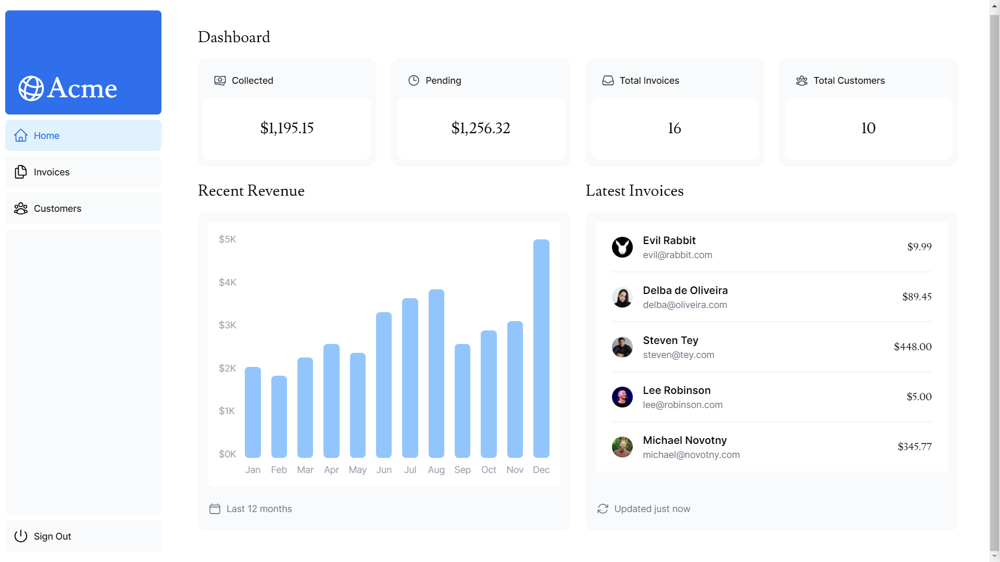

# 📊 Next.js Dashboard

A fairly simple dashboard application made using [Next.js](https://nextjs.org/)

 

**Try it here 👉** https://bunee-nextjs-dashboard.vercel.app/

I built this application following the [Learn Next.js](https://nextjs.org/learn) course. It's built using technologies such as React.js, TypeScript, PostgreSQL, and many more. Personally, I believe this approach was the most effective way to dive into Next.js as it encouraged hands-on learning.

For more information, see the [course curriculum](https://nextjs.org/learn) on the Next.js Website.
